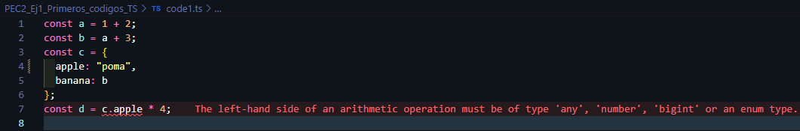

# Respostes teoria - Exercici 1  

Per provocar expressament un `TypeError` al fitxer `code1.ts`, s'ha modificat el valor de la propietat `apple` de l'objecte `c` perquè sigui un *string* en lloc d'un *number*. Això fa que l'operació de multiplicació definida a la variable `d` doni error, ja que no es pot multiplicar una cadena de text per un nombre.

A diferència de JavaScript, TypeScript ens avisa d'aquest tipus d'errors abans d'executar el codi, cosa que ens permet **detectar i corregir problemes durant el desenvolupament**, evitant errors futurs i millorant la fiabilitat del codi.

1. Per a cadascun dels valors del fitxer `code2.ts`, quin tipus de dades inferirà TypeScript? Expliqueu per què s'ha inferit aquest tipus de dades.

2. Per què es dispara cadascun dels errors del fitxer `code3.ts`?

3. Quina és la diferència entre una classe i una interfície a TypeScript?